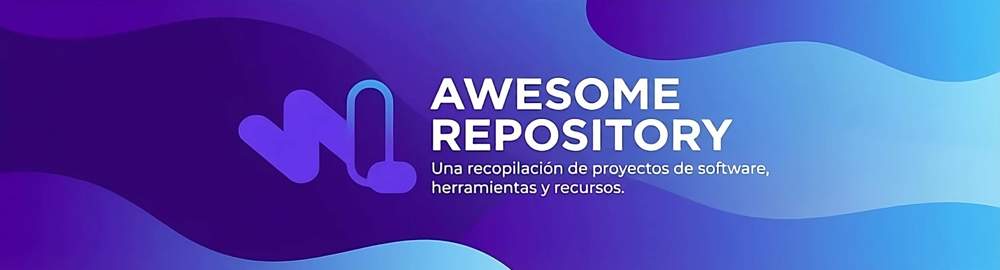

# ¡Bienvenido al Awesome Solana-WayLearn Repository!
Este es el punto de encuentro del talento Web3 en Latinoamérica. Somos wayLearn, una comunidad de aprendizaje y desarrollo Web3 apasionada por construir el futuro descentralizado.

En este repositorio encontrarás una colección de proyectos creados por miembros de la comunidad, demostrando sus habilidades en desarrollo de proyectos en la blockchain de Solana. Explora el código, inspírate con las soluciones y descubre el potencial de los builders latinos en la nueva web.

## Rust/Anchor
| Nombre del Proyecto | Descripción | Enlace al Repositorio |
|---------------------|-------------|-----------------------|
| The discipline Stake | El objetivo final es crear una "bóveda de voluntad" (Willpower Vault). Los usuarios apuestan (stake) tokens SOL por una tarea; si cumplen, recuperan su capital con XP/HP extra. Si fallan, el capital se quema o se envía a una tesorería, y su personaje sufre daño crítico. | https://github.com/fiedri/The_discipline_stake |
| Gimnasio-Solana | Sistema de gestión de un gimnasio desarrollado como Solana Program usando Rust + Anchor. Permite registrar miembros, gestionar rutinas de entrenamiento y acumular puntos de fitness, todo almacenado on-chain en la red Solana. | https://github.com/NixonVaultCode/Gimnasio-Solana |
| Trust-Work-Escrow | El proyecto Trust Work Escrow surge para resolver los problemas de confianza en el trabajo remoto, donde clientes y freelancers corren el riesgo de no recibir el trabajo o el pago acordado, además de enfrentar soluciones tradicionales costosas y poco eficientes. La plataforma propone un sistema de escrow on-chain en Solana: el cliente deposita los fondos en un vault seguro, el freelancer entrega el trabajo y, tras la aprobación, el pago se libera automáticamente. En caso de disputa, un árbitro interviene y distribuye los fondos de forma justa. | https://github.com/davidcoachdev/Trust-Work-Escrow |
| AnimeChain-Solana | Cada usuario que interactúa con el programa obtiene una PDA (Program Derived Address) única — una cuenta especial en la blockchain que actúa como su base de datos personal de animes. Esta cuenta es controlada exclusivamente por el programa y solo puede ser modificada por su dueño (owner). | https://github.com/YhonaPeguero/AnimeChain-Solana |
| Uma Solana | A text-based game inspired by Umamusume Pretty Derby, built in Rust. Train your Uma, manage her energy and mood, and compete in races. Lose too many times and she might retire for good. The project has two versions: a local CLI and an on-chain Solana program built with Anchor. | https://github.com/Hyromy/Uma-Solana |
| Boxchain | BoxChain — Torneos de box on-chain en Solana. Registra boxeadores, torneos y peleas. Los récords se actualizan automáticamente en la blockchain tras cada resultado 🏆 | https://github.com/JDaniel85/Box_Chain |
| INFRAESTRUCTURA PUBLICA DIGITAL PARA EL ECOSISTEMA VEHICULAR DE ONTARIO - SOL Car P2P Ontario | ste proyecto imagina un escenario donde el Ministry of Transportation of Ontario (MTO) ha tokenizado todos los vehículos registrados como NFTs en la blockchain de Solana. Cuando dos particulares realizan una compraventa: Vendedor y comprador están frente al auto ↓ Ambos conectan su wallet ↓ Vendedor lista el vehículo con el precio acordado ↓ Comprador ejecuta la transacción ↓ El contrato divide automáticamente: ├── Precio acordado → Vendedor (al instante) ├── 13% HST → MTO Ontario (automático) └── 0.5% fee → Protocolo ↓ El NFT del vehículo se transfiere al comprador Todo en una sola transacción. Sin filas. Sin papel. | https://github.com/MemoLabPRO/sol-car-p2p-ontario |
| MediPin World | MediPin World is a decentralized health infrastructure layer that puts hospitals, donors, and health data on-chain — creating a permissionless, auditable, and borderless network for global healthcare funding. | https://github.com/cosu123/medpin-world |
| pit_lane | Programa en Solana desarrollado con Anchor para registrar resultados de carreras de F1 on-chain. El contrato permite guardar resultados por carrera, validar reglas del podio y calcular puntos de forma determinística, incorporando condiciones de pista y el punto extra por vuelta rápida. | https://github.com/omancillav/pit_lane.git |
| Mi-Proyecto-Solana | El clasico proyecto de la biblioteca en Solana mejorado para una mayor gestion de informacion por libro y registro de clientes | https://github.com/bowsak/Mi-Proyecto-Solana/tree/main |
| solana-chat | Project Comments es un programa on-chain desarrollado en Solana (usando Anchor) que permite crear sistemas de comentarios descentralizados para publicaciones externas. El proyecto habilita la creación de hilos asociados a posts, donde los usuarios pueden comentar, responder, editar y eliminar mensajes, así como añadir reacciones. Incluye controles de elegibilidad de usuarios, moderación (bloqueo de hilos, eliminación por admins o autores) y validaciones de seguridad para garantizar la integridad de los datos. | https://github.com/augustofavrearg/solana-chat |
